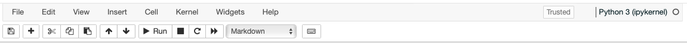

# Introduction to Jupyter notebook


Jupyter notebook is one of the products in Project Jupyter. The Jupyter name stands for three core programming languages it supported (Julia, Python, and R). Jupyter notebook is data scientist's favourite tool because of its interactive and clear Graphical User Interface (GUI). It is designed based on IPython Notebook. Let's explore some features of Jupyter. 

## Starting Jupyter

Jupyter is installed on the department machines. Usually, there are two ways to use jupyter, jupyter notebook and jupyter lab. Jupyter lab is recommended and supported by the Jupyter development team. However, we will stick with jupyter notebook for our training purpose. To start the jupyter notebook

```bash
(base) bash-4.4$ jupyter-notebook
```

If you need to start the jupyter notebook from your personal laptop and connect to our department cluster. You can check the instructions following [this link](http://physics.uwyo.edu/~brook/access_cluster/access_cluster.html) on setting up the port forwarding, and then using the following command to specify the port and tell jupyter to not start with a browser automatically (which tries to forward firefox GUI with X11). 

```bash
(base) bash-4.4$ jupyter-notebook --port=8888 --no-browser
```

If everything is successful, your web browser will show up automatically. If not, try to start your web browser and type `localhost:8888` in the link bar. 

## Some basic Jupyter commands



This control bar contains some very useful tools. We can save notebook, add, edit, merge "cells" 


Cell is a very important component of Jupyter notebook. Each cell is independent of each other, but is also connected. Cell is independent in the sense that a single cell contains some chunk code that we can execute without touching any other cell.
Cells are also connected because they share the same variables and modules with each other (ie. one cell declare a variable, and then you can use this variable from other cell directly). 

To execute a single cell, you can click `run` button on the control bar, or hit `shift+enter` as a shortcut.  The result will show up directly after each cell. If you want to run all cells sequentially from beginning to the end, you can hit the `fast-forward` button on the control bar. It is a good practice to run all cells at once when you are debugging or finish up your coding task, because some cells might be out of synchronized. In a notebook, you can run multiple cells, but only one cell can be executed by the computer each time and other cells will be waiting in line for previous one to be finished. If we want to stop the cell from running immediately, you can hit the `square` button. 

Jupyter notebook also supports markdown syntax. If we need to change a cell to markdown, we can press `Esc` and then hit `M`. Note that every time if you hit `Esc`, you will be in the command mode, which allows you to modify the notebook itself instead of the cell content. 

To save current jupyter notebook, you can hit `ctrl+s`. The jupyter notebook files have suffix `.ipynb` (because Jupyter is based on IPython Notebook). 

If you are interested in more cool shortcuts, `Help` tab on the control bar will give you more directions to explore. 